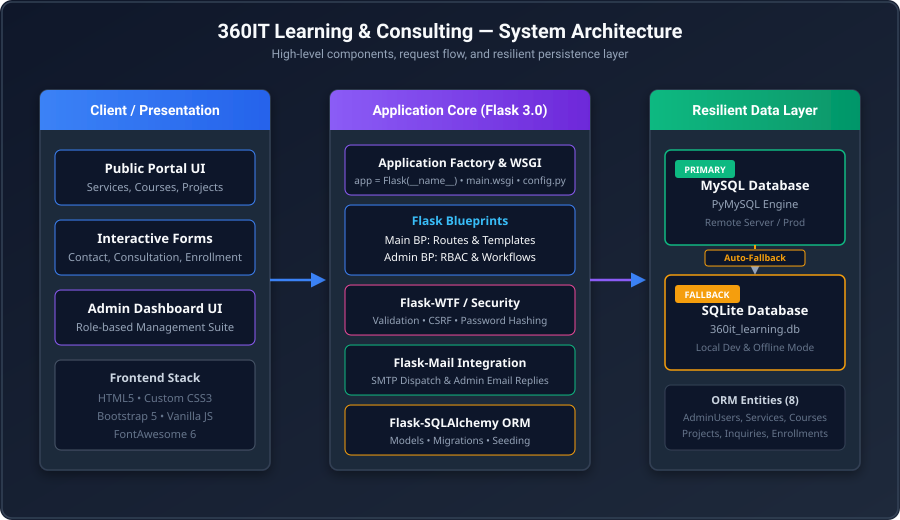
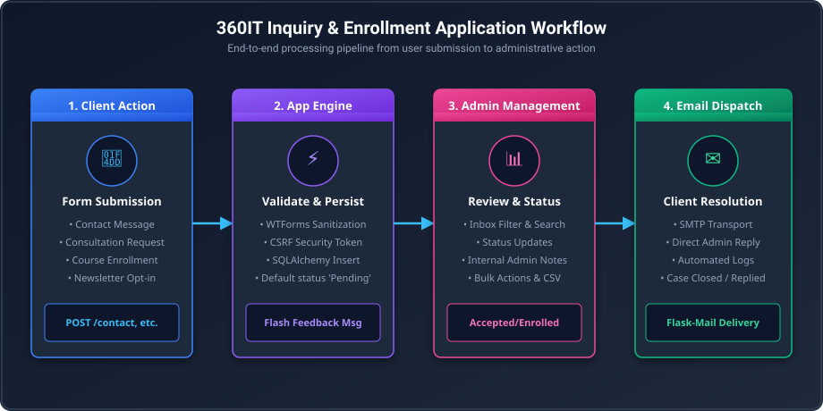
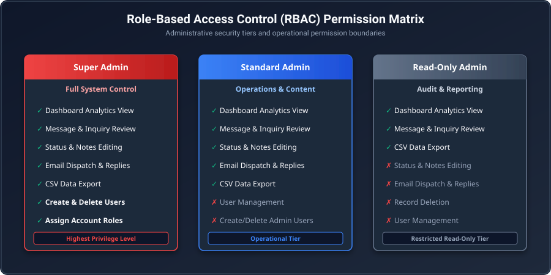

# 360IT Learning & Consulting — Enterprise Web Portal & Admin Management Platform

<p align="center">
  
</p>

<p align="center">
  <a href="#-technology-stack"></a>
  <a href="#-technology-stack"></a>
  <a href="#-database-architecture--entities"></a>
  <a href="#-database-architecture--entities"></a>
  <a href="#-role-based-access-control-rbac"></a>
  <a href="LICENSE"></a>
</p>

---

## 📋 Table of Contents

- [Overview](#-overview)
- [System Architecture](#-system-architecture)
- [Key Features &amp; Functional Modules](#-key-features--functional-modules)
  - [1. Public Client Portal](#1-public-client-portal)
  - [2. Inquiry &amp; Enrollment Pipeline](#2-inquiry--enrollment-pipeline)
  - [3. Enterprise Admin Management Suite](#3-enterprise-admin-management-suite)
- [Application Workflows](#-application-workflows)
- [Role-Based Access Control (RBAC)](#-role-based-access-control-rbac)
- [Database Architecture &amp; Entities](#-database-architecture--entities)
- [Technology Stack](#-technology-stack)
- [Project Directory Structure](#-project-directory-structure)
- [Getting Started &amp; Installation](#-getting-started--installation)
  - [Prerequisites](#prerequisites)
  - [Environment Setup](#environment-setup)
  - [Database Initialization &amp; Seeding](#database-initialization--seeding)
  - [Running the Development Server](#running-the-development-server)
- [Admin Dashboard Operations](#-admin-dashboard-operations)
- [Production Deployment](#-production-deployment)
- [License](#-license)

---

## 🚀 Overview

**360IT Learning & Consulting** is a full-stack corporate web application and administrative management system engineered for an IT consultancy and technical training provider. 

The platform delivers a modern, high-converting public interface showcasing enterprise IT consulting services (Cloud Migration, DevOps Transformation, Systems Architecture, Cyber Security), intensive technical training bootcamps (AWS, Azure, DevOps Engineering, Linux Administration), and portfolio case studies.

Behind the scenes, it features a secure, full-featured **Admin Management Suite** equipped with Role-Based Access Control (RBAC), multi-channel inbox management (Contact Messages, Consultation Bookings, Course Applications), status tracking, automated/manual email dispatching via SMTP, and CSV data export capabilities.

---

## 🏗️ System Architecture

The application is built on a modular Blueprint architecture in Flask with ORM abstraction, automated schema migrations, and a dual-database driver fallback mechanism ensuring zero downtime and high local-development resilience.



### Architectural Highlights

- **Blueprint Modularization**: Separated into `main` (Public Portal routes) and `admin` (Protected Management Suite routes).
- **Dual-Database Resilience**: Connects to a primary remote **MySQL** instance (`PyMySQL`). If the remote MySQL host is unreachable, the system automatically falls back to a local **SQLite** database (`instance/360it_learning.db`).
- **Dynamic Schema Migration**: Automatically detects missing table columns on app startup and applies ALTER TABLE migrations.
- **Auto-Seeding Engine**: Seeds sample service offerings, bootcamps, project portfolios, and admin user credentials if the database catalog is empty.

---

## 💡 Key Features & Functional Modules

### 1. Public Client Portal

- **Dynamic Service Showcase**: Detailed landing page and individual detail pages (`/services/<slug>`) highlighting key IT offerings.
- **Professional Training Programs**: Comprehensive course listings (`/training/<slug>`) featuring syllabus accordion viewers, skill levels, delivery modes (Online Live, Onsite, Hybrid), and duration details.
- **Projects & Contracts Portfolio**: Case studies showcasing tech stacks (AWS, Terraform, Docker, Kubernetes, Ansible) and industrial solutions (`/projects/<slug>`).
- **Technology Stack Visualizer**: Dedicated showcase page (`/technologies`) highlighting enterprise competencies across Cloud, DevOps, Database, Security, and Code.
- **Interactive Forms**: CSRF-protected submission forms for direct contact, consultation requests, and course applications with instant user feedback flash alerts.

### 2. Inquiry & Enrollment Pipeline



The application handles three distinct interaction pipelines:

1. **Contact Messages**: General enquiries processed with department categorization (`IT Consulting`, `Training Programs`, `Projects & Contracts`, `General`).
2. **Consultation Requests**: High-intent enterprise lead intake requesting cloud, infrastructure, or DevOps advisory.
3. **Course Enrollment Applications**: Student application pipeline tracking course preferences, preferred learning mode, and status updates (`Pending`, `Reviewed`, `Accepted`, `Enrolled`, `Rejected`).

---

### 3. Enterprise Admin Management Suite

Accessible via `/admin`, the management portal equips business administrators with:

- **Executive Analytics Dashboard**: Instant status metric cards, pending application highlights, and course popularity breakdown charts.
- **Multi-Filter Message Inboxes**: Tabbed filtering (`All`, `New`, `In Review`, `Replied`, `Archived`) and full-text search capabilities across submissions.
- **Status & Internal Note Management**: Update status tags and record internal administrative notes per application.
- **SMTP Email Dispatch**: Send direct email responses to clients and applicants directly from the dashboard view (`Flask-Mail`).
- **Bulk Action Capabilities**: Batch update statuses, mark items as read, or archive multiple records simultaneously.
- **CSV Data Export**: Instant CSV download of contact inquiries and course applications for CRM or reporting integration.

---

## 🔐 Role-Based Access Control (RBAC)

The administrative system strictly enforces security boundaries based on user roles:



| Feature / Permission | Super Admin | Standard Admin | Read-Only Admin |
| :--- | :---: | :---: | :---: |
| **Dashboard Analytics Access** | ✅ | ✅ | ✅ |
| **View Inquiries & Applications** | ✅ | ✅ | ✅ |
| **Export Data to CSV** | ✅ | ✅ | ✅ |
| **Edit Statuses & Internal Notes** | ✅ | ✅ | ❌ |
| **Send Email Replies via Dashboard** | ✅ | ✅ | ❌ |
| **Bulk Actions & Record Deletions** | ✅ | ✅ | ❌ |
| **Create & Delete Admin Accounts** | ✅ | ❌ | ❌ |
| **Assign User Roles** | ✅ | ❌ | ❌ |

---

## 🗄️ Database Architecture & Entities

The platform uses **SQLAlchemy ORM** mapping to 8 database models:

```
                  ┌──────────────────────┐
                  │      AdminUser       │
                  └──────────────────────┘
                             
   ┌──────────────────┐  ┌──────────────────┐  ┌──────────────────┐
   │     Service      │  │  TrainingCourse  │  │     Project      │
   └──────────────────┘  └──────────────────┘  └──────────────────┘

   ┌──────────────────┐  ┌──────────────────┐  ┌──────────────────┐
   │   Testimonial    │  │  ContactMessage  │  │EnrollmentRequest │
   └──────────────────┘  └──────────────────┘  └──────────────────┘
                         ┌──────────────────┐
                         │ConsultationReq.  │
                         └──────────────────┘
```

### Entity Specifications

1. **`AdminUser`**: Account credentials (`username`, `email`, `password_hash`), role attributes (`Super Admin`, `Admin`, `Readonly Admin`), and audit timestamps.
2. **`Service`**: Consulting services (`title`, `slug`, `icon`, `short_desc`, `long_desc`, `features_list`, `category`).
3. **`TrainingCourse`**: Bootcamp courses (`title`, `slug`, `duration`, `delivery_mode`, `skill_level`, `syllabus_list`, `featured`).
4. **`Project`**: Portfolio case studies (`title`, `slug`, `industry`, `tech_stack`, `short_desc`, `long_desc`, `image`).
5. **`Testimonial`**: Client reviews (`name`, `position`, `organization`, `service_type`, `quote`, `avatar`, `rating`).
6. **`ContactMessage`**: Contact submissions (`name`, `email`, `phone`, `subject`, `message`, `status`, `admin_notes`, `is_read`).
7. **`ConsultationRequest`**: Enterprise consultation leads (`name`, `email`, `phone`, `organization`, `service_interest`, `status`, `admin_notes`).
8. **`EnrollmentRequest`**: Bootcamp applications (`name`, `email`, `phone`, `course_title`, `delivery_mode`, `status`, `admin_notes`).

---

## 🛠️ Technology Stack

| Layer | Badge | Technology | Description |
| :--- | :--- | :--- | :--- |
| **Backend Core** |  | `Python 3.10+` | Core language execution environment |
| **Web Framework** |  | `Flask 3.0.3` | Lightweight, WSGI web application framework |
| **Database ORM** |  | `Flask-SQLAlchemy 3.1.1` | SQL toolkit and Object Relational Mapper |
| **Form Validation** |  | `Flask-WTF 1.2.1 / WTForms` | Form rendering, sanitization & CSRF protection |
| **Email Service** |  | `Flask-Mail 0.10.0` | SMTP email dispatches for responses & notifications |
| **DB Drivers** |   | `PyMySQL 1.1.1` & `SQLite3` | Production MySQL connector with local SQLite fallback |
| **Frontend Engine**|  | `Jinja2 3.1.6` | Modern template engine for Python |
| **Styling & UI** |  | `Custom CSS3` + `Bootstrap 5` | Dark/light themes, responsive glassmorphism UI |
| **Icons & Assets**|  | `FontAwesome 6` + `Google Fonts` | Vector typography & modern web icons |
| **WSGI Server** |  | `main.wsgi` / `Werkzeug 3.1.3` | Production deployment interface for Apache/Nginx |

---

## 📁 Project Directory Structure

```
360it-learning-consulting/
├── app/
│   ├── admin/                    # Admin Blueprint (Dashboard, RBAC, Data Exports)
│   │   ├── __init__.py           # Blueprint initialization
│   │   ├── forms.py              # Admin Auth, Reply, and User Management forms
│   │   └── routes.py             # Admin routes, CSV export logic, Email handlers
│   ├── static/                   # Static assets
│   │   ├── css/                  # Custom CSS stylesheets (style.css, admin.css)
│   │   ├── js/                   # Main JS scripts & theme togglers
│   │   └── images/               # Logos, course banners, project thumbnails, avatars
│   ├── templates/                # Jinja2 HTML Templates
│   │   ├── admin/                # Admin views (dashboard, messages, enrollments, users)
│   │   ├── about.html            # About Company page
│   │   ├── contact.html          # Contact page with form
│   │   ├── course_detail.html    # Course detail & syllabus viewer
│   │   ├── index.html            # Primary landing page
│   │   ├── project_detail.html   # Case study detail view
│   │   ├── service_detail.html   # Service detail view
│   │   └── training.html         # Training courses catalogue
│   ├── __init__.py               # Application factory & database fallback logic
│   ├── extensions.py             # Flask extensions (db, mail)
│   ├── forms.py                  # Public facing WTForms (Contact, Consultation, Enrollment)
│   ├── models.py                 # SQLAlchemy ORM Data Models
│   ├── routes.py                 # Public website routes & submission endpoints
│   └── seed.py                   # Catalog seeding data script
├── docs/
│   └── images/                   # Architecture & Workflow SVG visual diagrams
│       ├── application_workflow.svg
│       ├── rbac_matrix.svg
│       └── system_architecture.svg
├── instance/                     # Local SQLite database directory (if MySQL unreachable)
│   └── 360it_learning.db
├── config.py                     # Configuration settings & environment variables
├── main.py                       # Local development entry point
├── main.wsgi                     # Apache / Nginx WSGI deployment entry point
├── requirements.txt              # Production Python dependencies
├── dev_requirements.txt          # Development dependencies
└── README.md                     # Comprehensive Project Documentation
```

---

## ⚙️ Getting Started & Installation

### Prerequisites

- **Python 3.10+** installed on your system.
- **MySQL Server** (Optional for local testing; system automatically uses SQLite if MySQL is absent).
- `pip` and `virtualenv` package manager.

### Environment Setup

1. **Clone the repository**:
   ```bash
   git clone https://github.com/imosudi/360it-learning-consulting.git
   cd 360it-learning-consulting
   ```

2. **Create and activate a virtual environment**:
   ```bash
   python3 -m venv .venv
   source .venv/bin/activate
   ```

3. **Install required dependencies**:
   ```bash
   pip install -r requirements.txt
   ```

4. **Configure Environment Variables** (Optional, creates defaults automatically):
   Create a `.env` file in the project root:
   ```env
   SECRET_KEY=your_custom_secret_key_here
   DB_USER=debian-sys-maint
   DB_PASSWORD=your_mysql_password
   DB_HOST=127.0.0.1
   DB_NAME=360it-learning
   MAIL_SERVER=mio3.serverafrica.net
   MAIL_PORT=587
   MAIL_USERNAME=info@360it-learning.serverafrica.net
   MAIL_PASSWORD=your_mail_password
   ```

---

### Database Initialization & Seeding

The application automatically creates database tables and seeds initial data (services, courses, projects, testimonials, and default admin accounts) upon first execution!

To manually execute database seeding:
```bash
python -c "from app import app"
```

---

### Running the Development Server

Start the Flask local development server:

```bash
python main.py
```

The application will be accessible at:
- **Public Portal**: `http://127.0.0.1:5000`
- **Admin Dashboard**: `http://127.0.0.1:5000/admin`

---

## 🔑 Admin Dashboard Operations

### Default Admin Credentials

Upon initial launch, the system automatically creates default administrator accounts:

| Username / Email | Default Password | Assigned Role |
| :--- | :--- | :--- |
| `admin` | `admin123` | **Super Admin** |

> ⚠️ **Security Warning**: Change the default admin password immediately upon deploying to production!

### Common Admin Tasks

- **Reviewing Applications**: Navigate to `/admin/course-enrollments` or `/admin/contact-messages`.
- **Updating Application Status**: Open any record detail view to change status (`Pending` ➔ `Reviewed` ➔ `Accepted` ➔ `Enrolled`).
- **Replying via Email**: Fill out the "Send Reply" form within any record detail page to dispatch an email via SMTP.
- **Exporting Records**: Click **Export CSV** on the inbox header to download formatted CSV files.
- **Managing Dashboard Accounts**: (Super Admin only) Access `/admin/users` to create new admin users or delete accounts.

---

## 🌐 Production Deployment

The project includes a pre-configured WSGI entry point (`main.wsgi`) for web servers such as **Apache (mod_wsgi)** or **Nginx + Gunicorn**.

### Apache WSGI Configuration Example

```apache
<VirtualHost *:80>
    ServerName 360it-learning.com
    ServerAdmin webmaster@360it-learning.com

    WSGIDaemonProcess 360it python-home=/var/www/360it-learning-consulting/.venv python-path=/var/www/360it-learning-consulting
    WSGIScriptAlias / /var/www/360it-learning-consulting/main.wsgi

    <Directory /var/www/360it-learning-consulting>
        WSGIProcessGroup 360it
        WSGIApplicationGroup %{GLOBAL}
        Require all granted
    </Directory>

    Alias /static /var/www/360it-learning-consulting/app/static
    <Directory /var/www/360it-learning-consulting/app/static/>
        Require all granted
    </Directory>

    ErrorLog ${APACHE_LOG_DIR}/360it_error.log
    CustomLog ${APACHE_LOG_DIR}/360it_access.log combined
</VirtualHost>
```

---

## 📜 License

This project is licensed under the **BSD 3-Clause License**. See the [LICENSE](LICENSE) file for full details.

---

<p align="center">
  © 2026 360IT Learning &amp; Consulting. Developed by <a href="https://daybreakafrika.com.ng"><strong>Daybreak Afrika Technologies</strong></a>. All rights reserved. 
</p>
